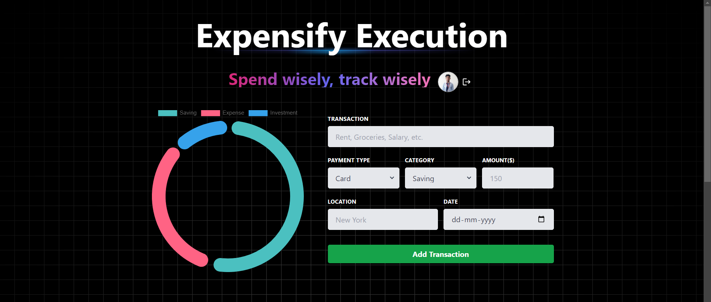

# Expensify

Expensify help you to manage your money by keeping all your expenses in one place, categorizing them, and providing a comprehensive view of your money.

<div align="center">

</div>

## Prerequisites

- [Node.js 20+](https://adoptium.net/temurin/releases/?version=17)
- [Nodemon](https://www.npmjs.com/package/nodemon)

## Getting Started with local development

Install dependencies

```bash
npm install
```

Change dir to start backend service

```bash
cd backend
npm run dev
```

Open [localhost:4000](http://localhost:4000)

### Set up client

Install dependencies

```bash
npm install
```

Change dir to start backend service

```bash
cd client
npm run dev
```

Open [localhost:4000](http://localhost:3000)

## License

[MIT license](./LICENSE)
